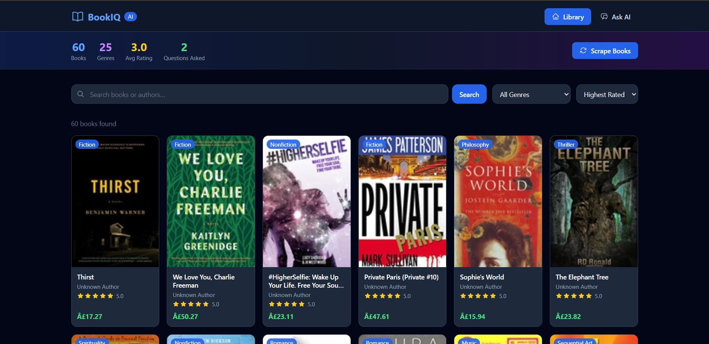
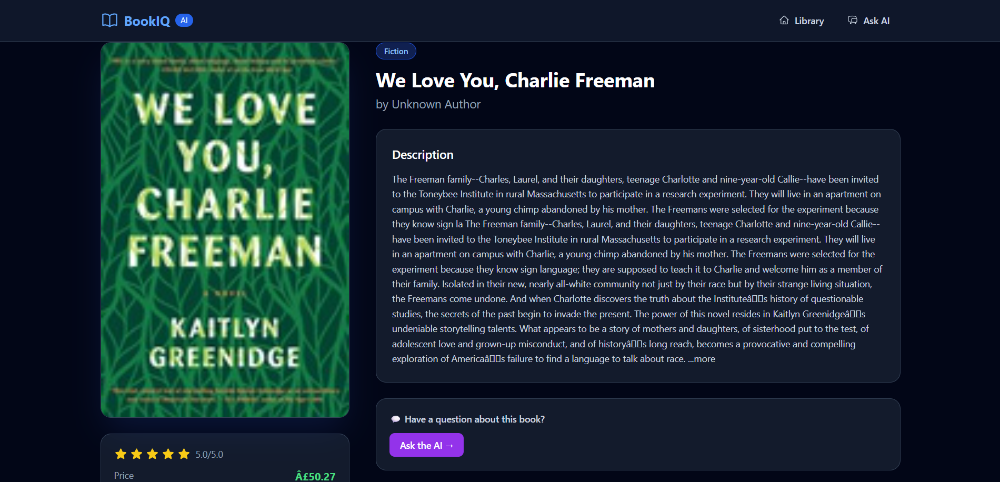
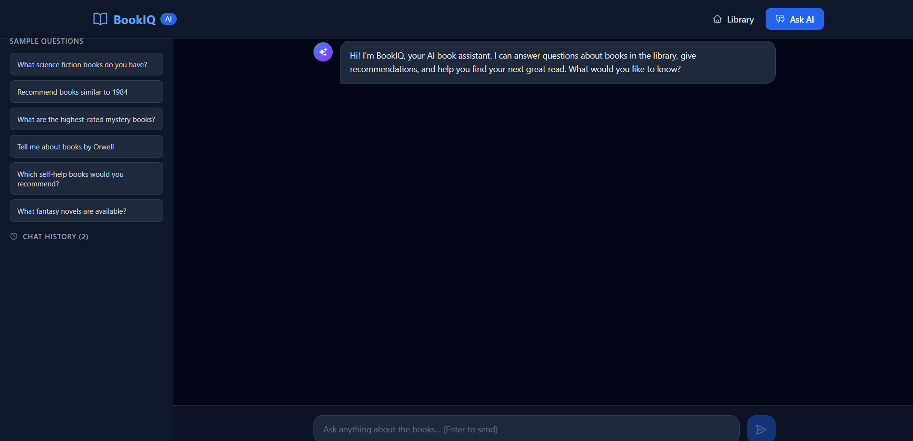
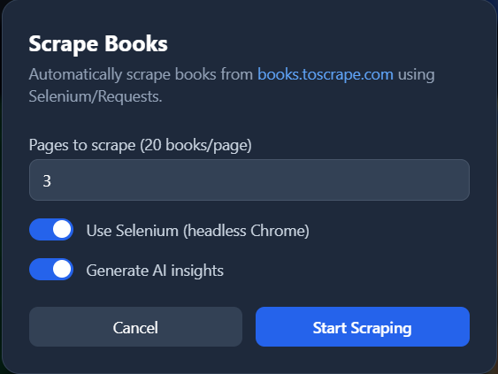

# 📚 BookIQ — AI-Powered Document Intelligence Platform

A full-stack web application with RAG (Retrieval-Augmented Generation) for intelligent book querying, automated web scraping via Selenium, and AI-generated insights powered by OpenRouter.

---

## 📸 Screenshots

### Dashboard — Book Library


### Book Detail — AI Insights & Recommendations


### Ask AI — RAG Chat Interface


### Scrape Books — Selenium Automation


---

## ✨ Features

- **RAG Pipeline** — Ask natural language questions, get AI answers with `[Book Title]` source citations
- **Selenium Scraper** — Headless Chrome scraper for books.toscrape.com (multi-page + detail pages)
- **AI Insights** — Auto-generated summaries, genre classification, sentiment analysis, key themes
- **Recommendations** — "If you liked X, you'll like Y" using TF-IDF cosine similarity
- **Response Caching** — AI responses cached for 24 hours to avoid repeated API calls
- **Smart Chunking** — Overlapping window chunking (50-word overlap) for better RAG retrieval
- **Chat History** — All Q&A saved to database, accessible in sidebar
- **Vector Search** — TF-IDF embedding-based similarity search across all book chunks

---

## 🛠️ Tech Stack

| Layer | Technology |
|---|---|
| Backend | Django 6.0 + Django REST Framework |
| Database | SQLite (dev) / MySQL (prod — config included) |
| Vector Store | Custom TF-IDF (ChromaDB/FAISS config included) |
| Frontend | React 18 + Tailwind CSS |
| Scraping | Selenium (headless Chrome) + BeautifulSoup4 |
| AI / LLM | OpenRouter API (`openrouter/free` — auto-selects best free model) |

---

## 🚀 Setup Instructions

### Prerequisites
- Python 3.10+
- Node.js 18+
- Google Chrome (for Selenium scraping)
- OpenRouter API key (free at [openrouter.ai](https://openrouter.ai))

### 1. Clone the repository

```bash
git clone https://github.com/YOUR_USERNAME/bookiq.git
cd bookiq
```

### 2. Backend Setup

```bash
cd backend

# Create and activate virtual environment
python -m venv venv
source venv/bin/activate        # Windows: venv\Scripts\activate

# Install dependencies
pip install -r requirements.txt

# (Optional) Set your OpenRouter API key as environment variable
# Otherwise the key in settings.py is used automatically
export OPENROUTER_API_KEY=your_key_here

# Run database migrations
python manage.py migrate

# Seed 20 demo books instantly (no API needed)
python manage.py seed_demo_data

# Or seed with AI insights generated (calls OpenRouter)
python manage.py seed_demo_data --with-ai

# Start the backend server
python manage.py runserver
```

Backend runs at: **http://localhost:8000**  
API base URL: **http://localhost:8000/api/**

#### Optional: Create admin user
```bash
python create_superuser.py
# Username: admin  |  Password: admin123
# Admin panel: http://localhost:8000/admin/
```

#### Optional: Switch to MySQL
1. Install: `pip install mysqlclient`
2. Create DB: `CREATE DATABASE bookiq_db CHARACTER SET utf8mb4;`
3. Uncomment the MySQL block in `backend/bookiq_backend/settings.py`

### 3. Frontend Setup

```bash
cd frontend

# Install dependencies
npm install

# Start the development server
npm start
```

Frontend runs at: **http://localhost:3000**

---

## 📡 API Documentation

### Books

| Method | Endpoint | Description |
|---|---|---|
| `GET` | `/api/books/` | List all books |
| `GET` | `/api/books/?search=harry` | Search by title or author |
| `GET` | `/api/books/?genre=Fantasy` | Filter by genre |
| `GET` | `/api/books/?sort=-rating` | Sort (options: `title`, `-title`, `rating`, `-rating`, `-created_at`) |
| `GET` | `/api/books/<id>/` | Full book detail + AI insights |
| `GET` | `/api/books/<id>/recommendations/` | Similar book recommendations |
| `POST` | `/api/books/upload/` | Manually add a book |

**POST `/api/books/upload/` — Request body:**
```json
{
  "title": "The Great Gatsby",
  "author": "F. Scott Fitzgerald",
  "rating": 4.5,
  "num_reviews": 1200,
  "description": "A story about the American Dream...",
  "genre": "Classic Fiction",
  "price": "£9.99",
  "availability": "In stock",
  "book_url": "https://example.com/gatsby"
}
```

### AI / RAG

| Method | Endpoint | Description |
|---|---|---|
| `POST` | `/api/ask/` | Ask a question using RAG pipeline |
| `GET` | `/api/chat-history/` | Retrieve past Q&A history |

**POST `/api/ask/` — Request body:**
```json
{ "question": "What dystopian books do you have?" }
```

**Response:**
```json
{
  "question": "What dystopian books do you have?",
  "answer": "Based on the library, we have [1984] by George Orwell which depicts a totalitarian society...",
  "sources": [
    { "title": "1984", "book_id": 9 },
    { "title": "The Hunger Games", "book_id": 4 }
  ],
  "chunks_used": 4
}
```

### Scraper

| Method | Endpoint | Description |
|---|---|---|
| `POST` | `/api/scrape/` | Trigger Selenium/requests web scraping |

**Request body:**
```json
{
  "max_pages": 3,
  "use_selenium": false,
  "generate_insights": true
}
```

**Response:**
```json
{
  "success": true,
  "total_scraped": 60,
  "created": 58,
  "updated": 2,
  "message": "Successfully processed 60 books"
}
```

### Utility

| Method | Endpoint | Description |
|---|---|---|
| `GET` | `/api/genres/` | List all genres with book counts |
| `GET` | `/api/stats/` | Platform stats (total books, avg rating, Q&A count) |

---

## 💬 Sample Questions & Answers

**Q: What science fiction books do you have?**
> Based on the library, we have **The Hunger Games** [The Hunger Games] by Suzanne Collins, set in a dystopian future where teenagers fight to the death. We also have **Dune** [Dune] by Frank Herbert, considered the greatest science fiction novel ever written, set on the desert planet Arrakis.

**Q: Recommend books similar to 1984**
> If you enjoyed 1984, I recommend **The Hunger Games** [The Hunger Games] — both explore totalitarian control and individual resistance. **Dune** [Dune] also shares themes of political manipulation and power struggles against oppressive systems.

**Q: What self-help books do you recommend?**
> The library has two excellent self-help titles: **Atomic Habits** [Atomic Habits] by James Clear focuses on building tiny daily habits that compound into remarkable results. **The Power of Now** [The Power of Now] by Eckhart Tolle teaches present-moment awareness as the key to peace and fulfillment.

**Q: Tell me about mystery books**
> For mystery lovers, **Sharp Objects** [Sharp Objects] by Gillian Flynn is a dark psychological thriller about a journalist investigating small-town murders. **The Girl with the Dragon Tattoo** [The Girl with the Dragon Tattoo] by Stieg Larsson follows journalist Mikael Blomkvist and hacker Lisbeth Salander uncovering decades-old crimes.

---

## 🏗️ Project Architecture

```
bookiq/
├── backend/
│   ├── bookiq_backend/
│   │   ├── settings.py          # Django config, OpenRouter key, DB settings
│   │   └── urls.py              # Root URL routing
│   ├── books/
│   │   ├── models.py            # Book, AIInsight, BookChunk, ChatHistory
│   │   ├── views.py             # All REST API endpoints (9 endpoints)
│   │   ├── serializers.py       # DRF serializers
│   │   ├── ai_service.py        # RAG pipeline, TF-IDF vectors, OpenRouter client
│   │   ├── scraper.py           # Selenium + BeautifulSoup scraper
│   │   └── management/commands/
│   │       └── seed_demo_data.py  # Demo data seeder (20 books)
│   ├── create_superuser.py
│   └── requirements.txt
│
├── frontend/
│   └── src/
│       ├── api.js               # Centralized API client
│       ├── pages/
│       │   ├── Dashboard.jsx    # Book grid, search, filter, pagination
│       │   ├── BookDetail.jsx   # Book info + AI insights + recommendations
│       │   └── AskAI.jsx        # RAG chat with source citations + history
│       └── components/
│           ├── Navbar.jsx
│           ├── BookCard.jsx
│           ├── ScrapeModal.jsx  # Scraper trigger UI
│           └── LoadingSpinner.jsx
│
├── screenshots/                 # UI screenshots for README
└── README.md
```

---

## 🎯 Bonus Features Implemented

| Feature | Implementation |
|---|---|
| ✅ Caching AI responses | Django `LocMemCache` with 24h TTL — avoids repeated OpenRouter calls |
| ✅ Embedding-based similarity | TF-IDF vectors + cosine similarity for RAG search and recommendations |
| ✅ Advanced chunking | Overlapping window chunking (300 words, 50-word overlap), sentence-aware |
| ✅ Multi-page scraping | Configurable `max_pages`, fetches individual book detail pages |
| ✅ Saving chat history | `ChatHistory` model + sidebar in Q&A interface |
| ✅ Loading states + UX | Animated spinner, bouncing dots while AI thinks, disabled states |
| ✅ Selenium scraper | Full headless Chrome support with requests/BeautifulSoup fallback |

---

## 🗄️ Database Schema

### `books_book`
| Column | Type | Description |
|---|---|---|
| id | INTEGER PK | Auto-increment |
| title | VARCHAR(500) | Book title |
| author | VARCHAR(300) | Author name |
| rating | FLOAT | Star rating (1.0–5.0) |
| num_reviews | INTEGER | Number of reviews |
| description | TEXT | Book description |
| genre | VARCHAR(200) | Genre category |
| price | VARCHAR(50) | Price string |
| availability | VARCHAR(100) | Stock status |
| book_url | URL | Source URL |
| cover_image_url | URL | Cover image URL |
| created_at | DATETIME | When scraped |

### `books_aiinsight`
| Column | Type | Description |
|---|---|---|
| book_id | FK → Book | One-to-one with Book |
| summary | TEXT | AI-generated summary |
| sentiment | VARCHAR(50) | Positive/Negative/Neutral/Mixed |
| sentiment_score | FLOAT | 0.0 (negative) to 1.0 (positive) |
| predicted_genre | VARCHAR(200) | AI genre classification |
| key_themes | TEXT | JSON array of themes |

### `books_bookchunk`
| Column | Type | Description |
|---|---|---|
| book_id | FK → Book | Parent book |
| chunk_index | INTEGER | Position in sequence |
| content | TEXT | Chunk text (300 words + 50 overlap) |
| chunk_id | VARCHAR(200) | Unique ID for vector store |

### `books_chathistory`
| Column | Type | Description |
|---|---|---|
| question | TEXT | User's question |
| answer | TEXT | AI's answer |
| sources | TEXT | JSON list of cited book titles |
| asked_at | DATETIME | Timestamp |